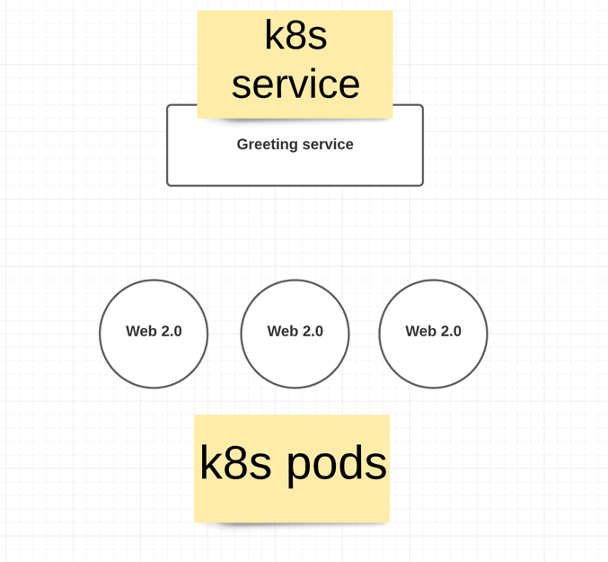
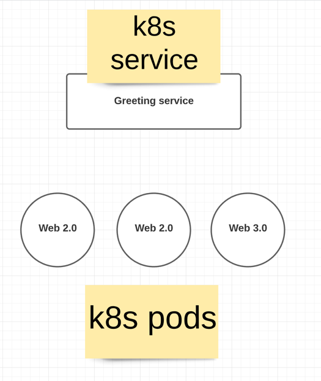
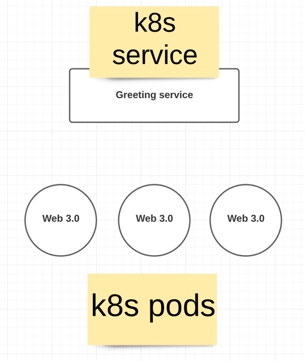
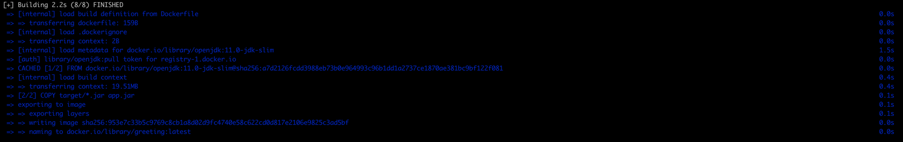
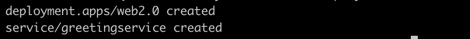
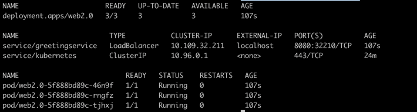
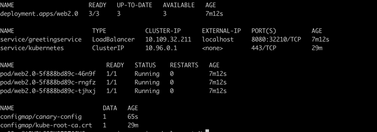
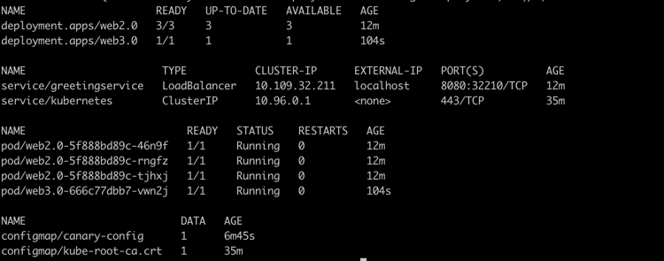
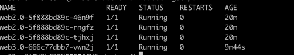
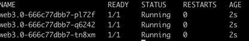

# Canary Deployments

Canary deployments are a pattern for rolling out releases to a subset of users or servers. The idea is to first deploy the change to a small subset of servers, test it, and then roll the change out to the rest of the servers.

In our below example you will learn following
* using the kubernetes labels to define the canary deployments
* Running multiple version of the application parrallel ,leave it to kubernetes service to load balance between new and old deployments
* test functionality of the new deployment
* Gracefully bring-down the old version


<b>Initial Status of the application</b>



<b>Intermediate Status of the application</b>



<b>Final status of the application</b>



Below is an small spring boot application which respond with greeting message

with initial deployment -> Hello from web2.0

with Final deployment -> Hello from web3.0

### Pre requisite installation

* Java 11
* maven
* kubernetes docker for desktop/minikube


### Tech

* Java 11
* Springboot
* Lombok
* Maven
* kubernetes
* Docker
    

### Clone 


### generate spring boot project command-line

```
curl https://start.spring.io/starter.tgz -d dependencies=web,lombok -d baseDir=canary-microservice-deployment -d bootVersion=2.6.3 -d javaVersion=11 | tar -xzvf -
```

### Copy docker file to root directory with name Dockerfile

```
FROM openjdk:11.0-jdk-slim
ARG JAR_FILE=target/*.jar
COPY ${JAR_FILE} app.jar
ENTRYPOINT ["java","-jar","/app.jar"]
```

### Build

```
mvn clean install
```


```
Build docker image 

docker build -t greeting . 
```




```
docker image ls  // list docker images

```


### Deploy

Kubernetes initial Deployment object with 3 replicas , notice labels with app: greeting and type:canary.

create kubernetes deployment and service file under k8s directory 

```
apiVersion: apps/v1
kind: Deployment
metadata:
  name: web2.0
  labels:
    app: greeting
    type: canary
spec:
  replicas: 3
  selector:
    matchLabels:
      app: greeting
  template:
    metadata:
      labels:
        app: greeting
        type: canary
    spec:
      containers:
        - name: greeting
          image: greeting:latest
          ports:
            - containerPort: 8080
          imagePullPolicy: IfNotPresent
```

Kubernetes service 

```

apiVersion: v1
kind: Service
metadata:
  name: greetingservice
spec:
  selector:
    app: greeting
  ports:
    - port: 8080
      targetPort: 8080
  type: LoadBalancer
  
```

```
kubectl create -f k8s/deployment.yaml
```



```
kubectl get deployment,svc,po
```


### Run

```
while true; do curl http://localhost:8080/; sleep 2; done

You will see the always spring-boot service will respond with Hello from web2.0 
```

## Canary deployment
update kubernetes deployment which uses configmap and diff replicas with new deployment name

```
apiVersion: apps/v1
kind: Deployment
metadata:
  name: web3.0
  labels:
    app: greeting
    type: canary
spec:
  replicas: 1
  selector:
    matchLabels:
      app: greeting
  template:
    metadata:
      labels:
        app: greeting
        type: canary
    spec:
      containers:
        - name: greeting
          image: greeting:latest
          imagePullPolicy: IfNotPresent
          env:
            - name: greeting.message
              valueFrom:
                configMapKeyRef:
                  name: canary-config
                  key: greeting.message
          ports:
            - containerPort: 8080
```

Create the configmap required for the new deployment

```
kubectl create configmap canary-config --from-literal=greeting.message="Hello from web3.0"
```


check the deployment objects to verify config map deployment

```
kubectl get deployment,svc,po,cm
```


deploy updated kubernetes deployment with latest changes as mentioned above 

```
kubectl create -f k8s/deployment-new.yaml
```




observe new deployment appeared with name web3.0 in the above image

Now 25% of the traffic will route to new service deployment, now verify the service response , which will have mixed response from old and new deployment

```
while true; do curl http://localhost:8080/; sleep 2; done
```


once you test and make sure the new changes in the deployment , now scale down the old deployment and make the new deployment 100%. 
currently we have an 3 replicas of old deployment and 1 replicas of new deployment

```
kubectl get deploy --show-labels
```




scale down the old deployment to zero instance and scale up the new deployment to 3 with below command

```
scale deploy web2.0 --replicas=0
kubectl scale deploy web3.0 --replicas=3
```


now test the application , which will respond always with new updated code.

```
while true; do curl http://localhost:8080/; sleep 2; done
```


